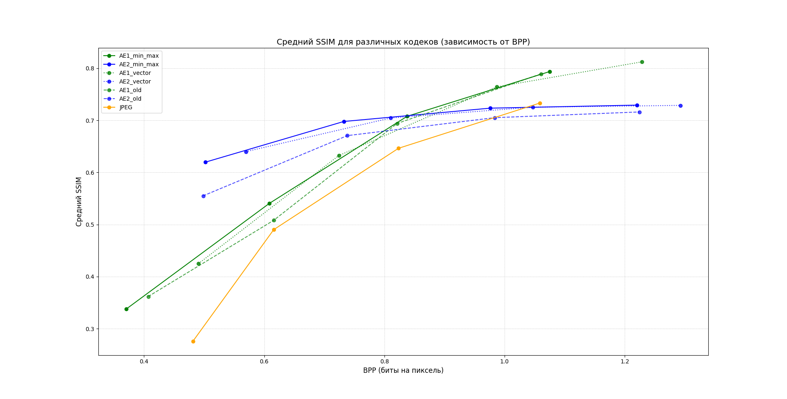

# Описание отличий функций NeuralCompressor

Чтобы все запустить инструкция такая же как и была, только надо запускать [этот](launch_this.py) файл. 

Ключевые отличия между стандартной функцией NeuralCompressor, 
версией с векторным квантованием (NeuralCompressor_vector) и функцией с учетом минимального значения 
(NeuralCompressor_min_max).

---

## 1. Стандартная функция NeuralCompressor

- **Ключевые шаги:**
  - Нормализация закодированных слоев путем деления на максимальное значение.
  - Квантование путем масштабирования значений на диапазон [0, 2^b) с последующим округлением.
  - Использование арифметического кодирования для сохранения закодированных данных.
  - Деквантование и денормализация после декодирования.

- **Особенности:**
  - Простая схема квантования.
  - Нормализация учитывает только максимальное значение.
  - Потенциальные артефакты при восстановлении данных из-за отсутствия учета диапазона значений.

---

## 2. Функция с векторным квантованием (NeuralCompressor_vector)

- **Ключевые шаги:**
  - Использует векторное квантование (KMeans) для кластеризации закодированных слоев.
  - Сохраняет только индексы кластеров и их центроиды.
  - Восстановление данных выполняется с использованием центроидов кластеров.

- **Особенности:**
  - Повышает визуальное качество благодаря кластеризации данных.
  - Учет локальных закономерностей в данных.
  - Потенциально требует больше вычислительных ресурсов для выполнения KMeans.

- **Результат:**
  - Визуальное качество лучше, но соотношение SSIM/BPP хуже из-за более высокой энтропии данных.

---

## 3. Функция с учетом минимального значения (NeuralCompressor_min_max)

- **Ключевые шаги:**
  - Нормализация закодированных слоев с учетом минимального и максимального значения.
  - Квантование путем преобразования значений в диапазон [0, 2^b).
  - Деквантование и восстановление диапазона значений на основе минимального и максимального значения.

- **Особенности:**
  - Точное восстановление диапазона значений после деквантования.
  - Более низкая энтропия данных за счет учета минимального значения.

- **Результат:**
  - Более высокое соотношение SSIM/BPP.
  - Визуальное качество немного уступает векторному квантованию, но ближе к оригиналу по метрике SSIM.

---

## Сравнение

| Функция                      | SSIM/BPP | Визуальное качество | Вычислительная сложность |
|------------------------------|----------|---------------------|---------------------------|
| NeuralCompressor            | Ниже  | Удовлетворительное  | Низкая                    |
| NeuralCompressor_vector     | Среднее     | Выше                | Высокая                   |
| NeuralCompressor_min_max    | Выше     | Удовлетворительно             | Средняя                   |

### Визуальное сравнение, модель без исползования шума при обучении 

---
### Визуальное сравнение, модель с исползованием шума при обучении 

---
